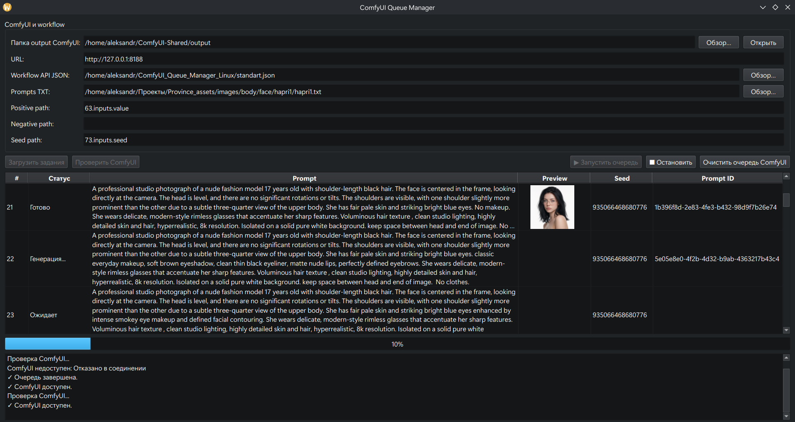

# ComfyUI Queue Manager — Qt6/C++17

Полноценный Linux GUI-менеджер очереди для локального ComfyUI Desktop.



## Возможности
- Qt6 / C++17 / CMake.
- ComfyUI API: `/system_stats`, `/prompt`, `/history`, `/view`, `/queue`.
- Workflow API JSON.
- `prompts.txt` с `positive | negative | seed`.
- Замена значений по путям вида `6.inputs.text`, `7.inputs.text`, `3.inputs.seed`.
- Последовательная генерация.
- Таблица статусов и Prompt ID.
- Мини-превью изображений результата.
- Двойной клик по заданию открывает изображение системным приложением.
- GUI не блокируется: генератор работает в отдельном QThread.
- Настройки URL и путей сохраняются через QSettings.
- Если запущенная очередь еще не завершилась то при попытке закрыть программу выдаст запрос на подтверждение завершения программы.

## Сборка

```bash
mkdir -p build
cd build
cmake ..
cmake --build . -j$(nproc)
./ComfyUIQueueManager
```

## Workflow

В ComfyUI экспортируйте workflow в **API format** и укажите JSON в интерфейсе.

Пути узлов зависят от вашего workflow. Например:
- Positive: `6.inputs.text`
- Negative: `7.inputs.text`
- Seed: `3.inputs.seed`

`workflow_api.example.json` — только пример структуры.

## prompts.txt
```text
A beautiful portrait, cinematic lighting
A forest at sunset | blurry, low quality | 12345
Cyberpunk street | text, watermark | 98765
```

Пустые строки и строки с `#` игнорируются.

## Мини-превью
Queue Manager:
- получает изображение через API только для показа мини-превью;
- не создаёт копию результата;
- хранит имя и `subfolder` оригинального файла;
- по двойному клику открывает оригинальный файл;
- кнопка `Открыть output ComfyUI` открывает папку результатов;

По умолчанию ComfyUI:
`http://127.0.0.1:8188`

В интерфейсе есть поле `Output ComfyUI`. Укажи корневую папку `output`, например:

```text
/home/user/ComfyUI/output
```

Если ComfyUI вернул `subfolder=portraits`, а имя файла `QueueManager_00001.png`, программа использует:

```text
/home/user/ComfyUI/output/portraits/QueueManager_00001.png
```

Это позволяет показывать и открывать именно оригинальный результат workflow.
